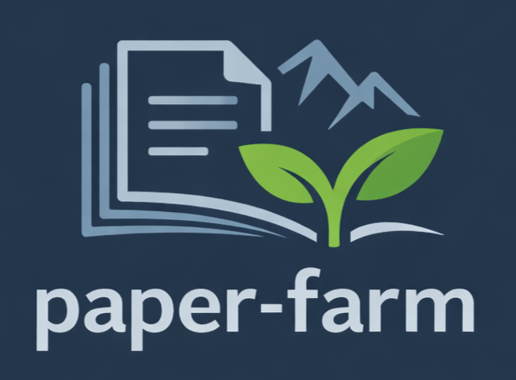
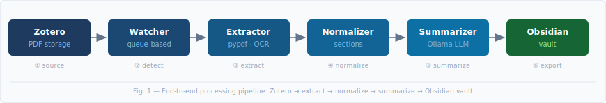
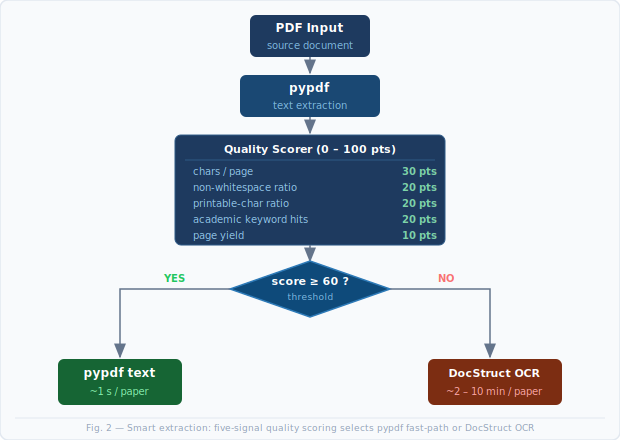

# paper-farm

A local-first, privacy-preserving pipeline for systematic literature management. paper-farm monitors a Zotero storage directory for incoming research PDFs, applies a multi-stage extraction and normalization process, generates structured summaries via a locally hosted LLM using a map-reduce strategy, and writes the results as annotated Markdown notes into an Obsidian vault — without transmitting any document content to external services.

한국어 문서: [README.ko.md](./README.ko.md)

<br clear="left" />

---

## Architecture

<p align="center">
  
</p>

> **Figure 1.** End-to-end processing pipeline. A queue-backed watcher thread polls Zotero storage at a configurable interval; detected PDFs are enqueued and processed sequentially through four stages — text extraction, normalization, LLM summarization, and Obsidian export — each result persisted to disk before the next stage begins.

### Pipeline stages

| Stage | Module | Description |
|-------|--------|-------------|
| **Ingest** | `watchers/` | Polls Zotero storage; deduplicates by path hash; enqueues new PDFs |
| **Extract & Normalize** | `extractors/`, `normalizers/` | Two-pass text extraction with quality gating; section boundary detection |
| **Summarize** | `summarizers/` | Map-reduce LLM summarization; structured JSON output |
| **Export** | `exporters/` | Renders Markdown with YAML front-matter; writes Obsidian vault directory |

Each paper produces a self-contained directory in the Obsidian vault:

```
<obsidian-vault>/
  NNN_<paper-id>/
    summary.md      ← structured summary with YAML front-matter (LLM-generated)
    metadata.json   ← title, authors, year, venue, DOI, paper_num, tags
    notes.md        ← user note template (Research Ideas / Questions / Follow-up)
    paper.pdf       ← copy of the source PDF
```

`NNN` is a stable three-digit identifier assigned once at first export and persisted in `metadata.json`; subsequent pipeline runs preserve the same number.

---

## Requirements

- Python 3.11+
- [Ollama](https://ollama.com) running locally — `ollama serve`
- A pulled model, e.g. `ollama pull phi4:14b`
- *(Optional)* Rust toolchain — only needed for DocStruct OCR on scanned PDFs

---

## Install

```bash
git clone --recurse-submodules <repo-url>
cd paper-farm-lab

# with uv (recommended)
uv sync

# or pip
pip install -e .
```

---

## Configure

```bash
paper-farm init-config        # writes paper-farm.toml in the current directory
```

Edit the generated file:

```toml
[paths]
obsidian_vault = "~/Documents/Obsidian/Research/papers"

[llm]
backend  = "ollama"
model    = "phi4:14b"         # run: ollama pull phi4:14b
timeout  = 600                # seconds; 600 recommended for 14B models

[summary]
language = "en"               # en / ko / ja / zh / fr / de / es

[watcher]
zotero_storage = "~/Zotero/storage"
poll_interval  = 30           # seconds between scans
```

> **Zotero storage path**
> macOS / Windows: `~/Zotero/storage` · Linux (snap): `~/snap/zotero-snap/common/Zotero/storage`

---

## Usage

### Automatic mode (recommended)

Watch Zotero and process new papers as they arrive:

```bash
paper-farm watch
```

Or use the provided shell helpers:

```bash
scripts/start-watch.sh       # launches watcher and writes logs to logs/
scripts/monitor.sh           # live dashboard — queue status, progress, recent logs
```

### Manual mode

```bash
# Full pipeline in one command
paper-farm run /path/to/paper.pdf --title "Attention Is All You Need" \
    --authors "Vaswani, Shazeer" --year 2017

# Stage-by-stage
paper-farm ingest    /path/to/paper.pdf
paper-farm parse     <paper-id>
paper-farm summarize <paper-id>
paper-farm export    <paper-id>
```

### Inspection

```bash
paper-farm list               # all registered papers
paper-farm show <paper-id>    # metadata + artifact status per stage
```

---

## Text Extraction

<p align="center">
  
</p>

> **Figure 2.** Two-stage extraction strategy. pypdf is attempted first; a five-signal quality scorer determines whether the extracted text is sufficient. Papers scoring below the threshold of 60/100 are re-processed with DocStruct — a Rust/Tesseract pipeline for scanned documents — at the cost of higher latency.

Text extraction uses a two-pass strategy with automated quality gating:

1. **Primary pass (pypdf):** Direct text layer extraction; fast and sufficient for digitally typeset PDFs.
2. **Secondary pass (DocStruct OCR):** Activated when the quality score falls below threshold. Renders each page to a raster image and applies Tesseract OCR, recovering text from scanned or image-based PDFs.

The quality scorer aggregates five signals:

| Signal | Weight | Rationale |
|--------|--------|-----------|
| Characters per page | 30 pts | Proxy for content density; low scores indicate image-only pages |
| Non-whitespace ratio | 20 pts | Detects pages with excessive padding or layout artifacts |
| Printable-character ratio | 20 pts | Discriminates valid text from OCR noise or binary data |
| Academic keyword hits | 20 pts | Verifies presence of structural markers (*abstract*, *introduction*, *references*, …) |
| Page yield | 10 pts | Fraction of pages producing non-empty output |

### Build DocStruct (optional — scanned PDFs only)

```bash
git submodule update --init --recursive
cargo build --release --manifest-path external/DocStruct/Cargo.toml
pip install "Pillow>=11,<12" pytesseract pdf2image "opencv-python>=4.8,<5" numpy
```

If the binary is absent, paper-farm falls back to pypdf automatically.

---

## Summarization

paper-farm employs a **map-reduce** strategy to generate summaries that provide uniform coverage across all sections of a paper, including long methodological and experimental sections that a single-pass approach would truncate.

**Map phase.** Each section whose character count exceeds a configurable threshold (default: 2 000 chars) is individually condensed to approximately 150 words via a focused LLM call. The prompt instructs the model to extract the core contribution, methodology, quantitative results, and any stated limitations for that section only. Short sections are passed through verbatim.

**Reduce phase.** The condensed section texts are concatenated and submitted to the LLM in a single structured extraction call. The model is asked to produce a JSON object with ten fields — `summary`, `problem`, `key_idea`, `method`, `experiment`, `results`, `contributions`, `limitations`, `future_work`, and `keywords` — following strict rules that preserve technical terminology in English regardless of the output language.

This design separates *coverage* (map) from *synthesis* (reduce), improving fidelity on papers with dense Results or Methods sections without increasing the reduce call's context length.

The `experiment` field is a nested JSON object with keys `dataset`, `simulator`, and `metric`, enabling structured querying across a corpus.

---

## Project layout

```
src/paper_farm/
  cli.py            CLI entry point (Typer)
  config.py         Settings — loaded from paper-farm.toml
  pipeline/         PipelineService: ingest → parse → summarize → export
  extractors/       SmartExtractor, SimpleTextExtractor, DocStructExtractor
  normalizers/      Text cleaning and section boundary detection
  summarizers/      OllamaSummaryBackend (map-reduce), LocalSummaryBackend (rule-based)
  exporters/        Obsidian Markdown + metadata.json writer
  watchers/         ZoteroWatcher — scanner thread + worker queue
  storage/          File-backed repository (data/)
data/               Pipeline cache — excluded from git (see .gitignore)
scripts/            Shell helpers: start-watch.sh, monitor.sh, sync.sh
external/DocStruct  OCR submodule (Rust + Tesseract)
```

---

## Development

```bash
uv sync
uv run pytest
```
